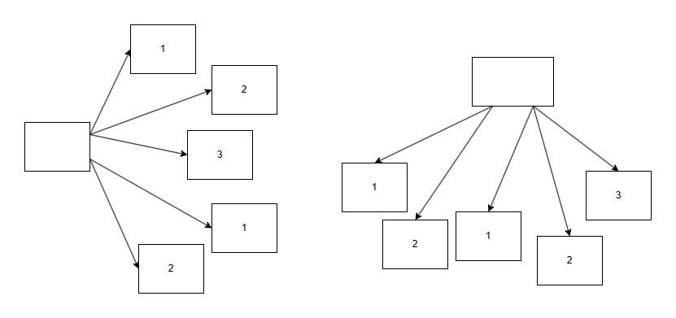
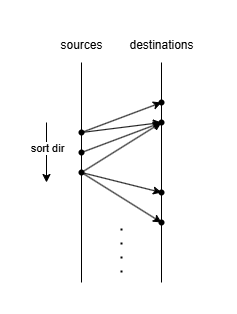
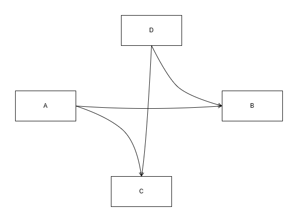

# Edge的全排序

Node之间通过Edge建立联系。因为Node分为InputPort和OutputPort，因此Edge是有向的。

拓扑结构中，存在一种星形构型，即一个port（即引脚）发散出多个连接，既可能是汇聚（N->1），也可能是发散（1->N），这种构型有时需要明确分支edge之间的顺序。比如：行为树中Selector结点会发散到下级节点，结果保存到一个有序的列表容器中；数组构建结点需要汇聚多个有序的结点作为输入，结果保存到一个有序的列表容器中。

为了简化及优化数据存储，需要尝试把所有的Edge按照顺序全部排列。如果存在这样的全排序，那么在反序列化时，对于每个Edge只需要找到自己所属的两个出入结点，并且按迭代顺序添加到结点的Edge有序列表容器中，他们就是正确排序的。

因此这篇文档需要回答两个问题：

1. 对于任意拓朴结构，是否一定存在一个全排序，使所有的Edge满足各自组内的排序规则
2. 如果不一定存在，给出一个反例；如果一定存在，给出一个排列算法

## 细节分析

实际结点分为4类：
* 水平引脚：左输入→
* 垂直引脚：上输入↓
* 水平引脚：右输出→
* 垂直引脚：下输出↓

对于一个星形构型。如果公共点为水平引脚，则以远端结点的Y坐标排序；如果公共点为垂直引脚，则以远端结点的X坐标排序。因此，水平引脚和垂直引脚视角下，每个结点分别有不同的权重值。

需要注意到，一个edge有可能同时属于两个星形结构，因此对于每个Edge它需要同时满足两个排序要求。

## 环路检查

如果存在一个反例，那么这个反例的排序一定存在环路（反之亦然，充要问题），即：$e_1<e_2<...<e_n<e_1$

如果$e_1<e_2$，说明$e_1$和$e_2$一定有公共点。

> 一维全排序。容易发现，一维情况（只有上下引脚或只有左右引脚）下，一定存在全排序。如上图所示，原点左侧原点代表排序后的出发引脚，右侧原点代表排序后的到达引脚，箭头代表Edge。

一维情况下，容易证明全排序总是存在的，并且可以挤压成一维张量；二维情况下，情况有些许不同，我们可以给出一个反例。

对于A：AB<AC

对于B：DB<AB

对于C：AC<DC

对于D：DC<DB

DC<DB<AB<AC<DC，成环

## 完全图约化

如果一个完全图存在全排列，那么任意子图都一定存在全排列。

|H|$N_{1hi}$|$N_{1vi}$|$N_{2hi}$|$N_{2vi}$|...|$N_{nhi}$|$N_{nvi}$|
|:-:|:-:|:-:|:-:|:-:|:-:|:-:|:-:|
|$N_{1ho}$|:x:|:x:
|$N_{2ho}$|||:x:|:x:
|...|
|$N_{nho}$||||||:x:|:x:

|V|$N_{ahi}$|$N_{avi}$|$N_{bhi}$|$N_{bvi}$|...|$N_{nhi}$|$N_{nvi}$|
|:-:|:-:|:-:|:-:|:-:|:-:|:-:|:-:|
|$N_{avo}$|:x:|:x:
|$N_{bvo}$|||:x:|:x:
|...|
|$N_{nvo}$||||||:x:|:x:

观察上图矩阵即可知存在这样的全排列。不难发现，H和V可以互相穿插组合。

在实践中，我们通常不会涉及不同朝向的起点汇聚到一起，因此，我们可以保持H和V独立于彼此，上下拼合成一个方阵。这样我们就可以得到一个全排序。

根据方阵我可以得到排序权重序列如下：

* 起点V or H
* 起点结点按起点规则排序后的下标
* 起点引脚下标
* 终点结点按起点规则排序后的下标
* 终点V or H
* 终点引脚下标
* edge guid (防止排序算法不稳定)
